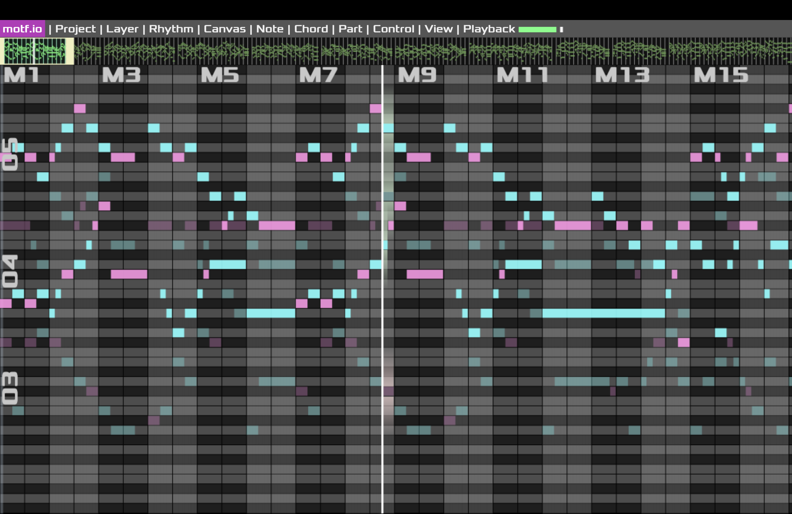

# EDDY'S CYBER GARAGE!

With love, for my son Mars Z. Dong.

[GO BACK TO MAIN](index.md)

### APOLLO MUSIC IMPROVISING

A project using rule based plus data driven methods to help composers to study and improvise music, including scales, chords, rhythms and more. It features a very easy to use yet very powerful browser-based pianoroll, with some built-in AI tools to assist music analysis and creation. 

The project is 100% in pure Javascript.

It's a long-term one and currently still in early stage.

Some screenshots showing the recent progress:

Auto-chord by Apollo for an improvised melody by itself
<video width="80%" controls>
  <source src="img/apollo/492.mp4" type="video/mp4">
  Your browser does not support the video tag.
</video>

Multi-track improvised loop 100% by Apollo
<video width="80%" controls>
  <source src="img/apollo/loop demo1.mp4" type="video/mp4">
  Your browser does not support the video tag.
</video>

Multi-track improvision in non-major/minor scales 100% by Apollo
<video width="80%" controls>
  <source src="img/apollo/337.mp4" type="video/mp4">
  Your browser does not support the video tag.
</video>

An un-named jazz improvision 70% done by apollo
<video width="80%" controls>
  <source src="img/apollo/25.mp4" type="video/mp4">
  Your browser does not support the video tag.
</video>

A piece called "Redemption" 70% done by apollo
<video width="80%" controls>
  <source src="img/apollo/redemption.mp4" type="video/mp4">
  Your browser does not support the video tag.
</video>

Backstage 1: Apollo improvising some element for "Redemption"
<video width="80%" controls>
  <source src="img/apollo/IMG_1148.mp4" type="video/mp4">
  Your browser does not support the video tag.
</video>

Backstage 2: Apollo improvising some element for "Redemption"
<video width="80%" controls>
  <source src="img/apollo/IMG_1174.mp4" type="video/mp4">
  Your browser does not support the video tag.
</video>

[Listen to the endless Bach Chorales! (Press Enter to start after loading)](https://eddydong.github.io/apollo)

[GO BACK TO MAIN](index.md)