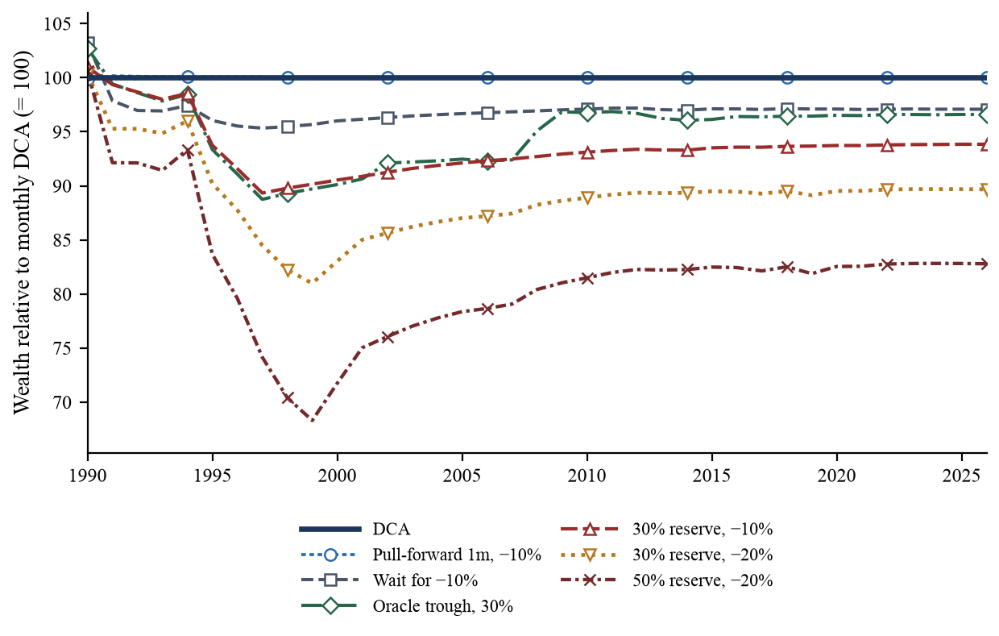
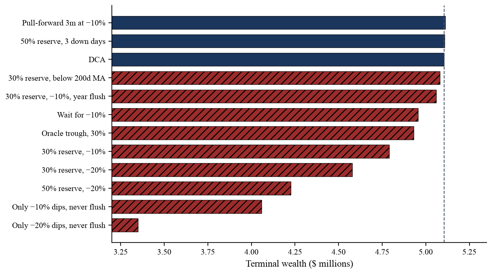
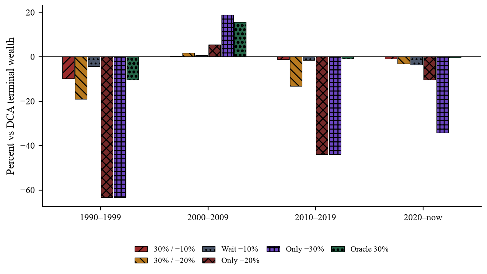

# EDDY'S CYBER GARAGE!

With love, for my son Mars Z. Dong.

[GO BACK TO MAIN](index.md)

### BUY THE DIP

Working paper and replication code: does a mechanical “buy the dip” overlay beat dollar-cost averaging in the S&P 500?

[View the PDF](Buy_the_Dip_Fair_Capital_Tests.pdf) · [GitHub project](https://github.com/eddydong/buy-the-dip)

If monthly income, then DCA. If a pile is already in hand for the long run, then lump sum. Crash reserves and wait-for-a-dip lose to those two schedules in this sample.





---

# Does “Buy the Dip” Improve Dollar-Cost Averaging?

Working paper and replication code for fair-capital tests of mechanical “buy the dip” rules against dollar-cost averaging in the S&P 500, January 1990–August 2026.

**Paper:** Dong, Eddy K. 2026. *Does “Buy the Dip” Improve Dollar-Cost Averaging? Evidence from Fair-Capital Experiments in the S&P 500, 1990–2026.* Working paper. [PDF](Buy_the_Dip_Fair_Capital_Tests.pdf) · [source on GitHub](https://github.com/eddydong/buy-the-dip/blob/main/paper/Buy_the_Dip_Fair_Capital_Tests.pdf)

## The question

Popular advice treats buying the dip as a free upgrade on a monthly S&P 500 contribution: if investing every paycheck works over a long horizon, holding cash for a cheaper entry should work better. That claim mixes two problems and two slogans.

| Problem | What the saver actually has | Fully invested policy |
| --- | --- | --- |
| **Paycheck stream** | Cash arrives over time | Invest each contribution when it arrives (monthly DCA) |
| **Cash pile** | A lump is already in hand | Invest it now (lump sum) |

The first slogan—“do not stop buying in a crash”—is DCA. The second—“stay underinvested until a crash”—is timing. This project tests the second slogan under a strict same-cash constraint.

## Design

- **Vehicle:** Vanguard 500 Index Fund Investor shares (VFINX), daily total return.
- **Window:** live contributions from 2 January 1990 through 14 August 2026 (9,219 trading days, 440 months, $1,000 per month, $440,000 contributed).
- **Idle cash:** 13-week Treasury bill yield, compounded daily.
- **115 mechanical rules** in seven families: cash reserves (“powder”), wait / only-dip, pull-forward of already-committed paychecks, extra-capital sleeves, an oracle that buys exact troughs, and a robustness set that takes the signal from the S&P 500 price index.
- **Fair capital:** every same-budget rule receives the same dollars on the same dates. Dip extras come from cash held back, a year-end leftover, or an interest-free pull-forward of a future contribution that is later skipped. No outside capital.
- **No lookahead on tradable rules:** signals use the previous close; dip fills are the next close.
- **Price series:** Yahoo’s backward-adjusted close is not used as a trade price. The backtest builds a forward total-return path that starts at the actual NAV and compounds adjusted-close returns, so a “10% dip” is a 10% move in a tradable total-return unit.

## Headline results

In this sample, tradable crash-timing does not beat monthly DCA by an economically meaningful margin.

- Monthly DCA finishes at **$5.105 million**.
- Rules that wait for 10–20% peak drawdowns lose **3–17%** of terminal wealth. A 50% reserve for 20% crashes finishes at $4.227 million (−17.2%).
- A dollar delayed until a 10% drawdown, never flushed at year-end, is filled on average after **263 trading days** at a total-return price **22% higher** than the contribution-date price, not lower. Mean relative terminal payoff of that delay: **−8.84%** (Newey–West *t* = −2.95).
- The best same-budget tradable rule is only-dip on three consecutive down days: **+0.16%**. Pull-forward of three months at a 10% drawdown: **+0.13%**. These are rounding error; they are DCA in disguise or a few weeks of extra exposure, not crash timing.
- An extra $300/month “dip sleeve” captures **66–79%** of the incremental wealth of simply DCAing that extra $300 when the sleeve waits for 10–20% peak drawdowns.
- For a **$100,000 pile** already in hand, across 320 ten-year windows: lump sum first, then 12-month DCA of the pile (median **−4.6%** vs lump), then wait-for-a-dip last (median **−10.5%** / **−19.8%** for −10% / −20% unlimited waits).
- All T-bills: **$738k**. The “failed” only-dip −20% rule that lost 34% to DCA still finished at **$3.35 million**—better than never buying equities, worse than the monthly schedule.

The one calendar decade in which crash-waiting beat DCA is **2000–2009**. The same −20% never-flush rule lost **−63%** vs DCA in the 1990s and **−44%** in the 2010s. That cell is an exception, not a policy.



## Practical summary

For a long-horizon S&P 500 saver in this record:

1. **If cash arrives over time and will be invested in the index, invest it as it arrives** (monthly DCA). Do not hold a crash fund out of those paychecks.
2. **If a pile is already in hand for the long run, invest it now** (lump sum). Spreading it is sleep insurance, historically about 5% of ten-year terminal wealth. Waiting for a dip is worse insurance than that.
3. Money needed in a few years for rent, tuition, or a house is a cash problem, not an entry-rule problem.

“Buy the dip” as *keep buying in a crash* is already rule 1. “Buy the dip” as *dry powder until −20%* is the strategy the tests reject.

## Repository

Code, data, figures, and the paper live in [github.com/eddydong/buy-the-dip](https://github.com/eddydong/buy-the-dip).

| Path | What it is |
| --- | --- |
| [`paper/Buy_the_Dip_Fair_Capital_Tests.pdf`](https://github.com/eddydong/buy-the-dip/blob/main/paper/Buy_the_Dip_Fair_Capital_Tests.pdf) | Working paper |
| [`paper/manuscript.html`](https://github.com/eddydong/buy-the-dip/blob/main/paper/manuscript.html) | HTML source of the PDF |
| [`paper/figures/`](https://github.com/eddydong/buy-the-dip/tree/main/paper/figures) | Figures 1–8 |
| [`paper/make_assets.py`](https://github.com/eddydong/buy-the-dip/blob/main/paper/make_assets.py) | Contribution-level tests, market moments, figure generation |
| [`backtest.py`](https://github.com/eddydong/buy-the-dip/blob/main/backtest.py) | Paycheck-stream catalog (115 rules), decades, rolling windows |
| [`pile.py`](https://github.com/eddydong/buy-the-dip/blob/main/pile.py) | Cash-pile experiment: lump vs DCA-the-pile vs wait-for-a-dip |
| [`data/market.csv`](https://github.com/eddydong/buy-the-dip/blob/main/data/market.csv) | Cached daily VFINX / S&P 500 / T-bill series used in the paper |
| [`results/`](https://github.com/eddydong/buy-the-dip/tree/main/results) | `summary.json`, `full_period.csv`, `pile.json` |

## Replication

```bash
python3 -m venv .venv
.venv/bin/pip install -r requirements.txt
.venv/bin/python backtest.py
.venv/bin/python pile.py
.venv/bin/python paper/make_assets.py
```

`backtest.py` reuses `data/market.csv` when present (otherwise it downloads from Yahoo Finance). `paper/make_assets.py` writes figures under `paper/figures/` and `paper/stats.json`. The PDF is printed from `paper/manuscript.html`.

## Data

Daily prices are from Yahoo Finance: VFINX unadjusted NAV and adjusted close, the S&P 500 price index, and the 13-week Treasury bill discount. The paper’s live window and numbers are those in `results/` and `paper/stats.json`. Re-downloading will move the end date.

This is a historical record of one fund, one country, and one overlapping 36-year path. It is not a forecast, and it is not investment advice.

[View the PDF](Buy_the_Dip_Fair_Capital_Tests.pdf) · [GitHub project](https://github.com/eddydong/buy-the-dip) · [GO BACK TO MAIN](index.md)
