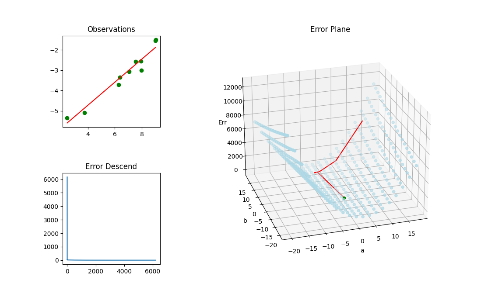

# EDDY'S CYBER GARAGE!

With love, for my son Mars Z. Dong.

[GO BACK TO MAIN](index.md)

### GRADIENT DESCEND FROM SCRATCH

Implementation of the Gradient Descend algorithm for estimating a simple classical linear model, the Least Square, with pure python & numpy. Can be upgraded to a fully functional neuron network framework.

[View The Source Code](https://github.com/eddydong/PycharmProjects/blob/main/pythonProject/leastsq_test.py)

[GO BACK TO MAIN](index.md)