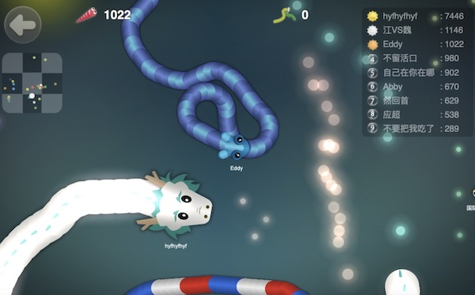
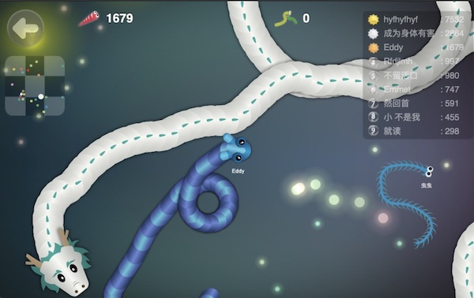
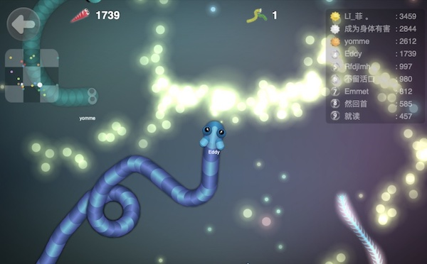
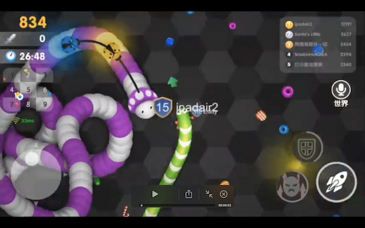
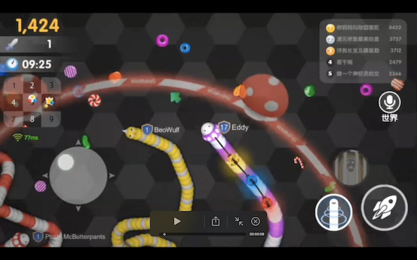
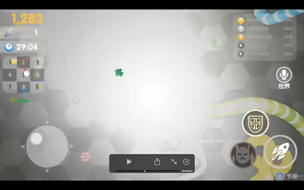
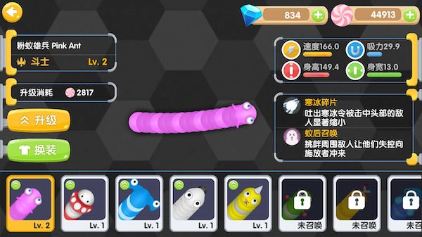

# EDDY'S CYBER GARAGE!

With love, for my son Mars Z. Dong.

[GO BACK TO MAIN](index.md)

### GREEDY WORMS (FOR MY SON MARS)

<video width="480" controls>
  <source src="img/greedy_worms/teaser.mp4" type="video/mp4">
  Your browser does not support the video tag.
</video>

[Play the prototype with AI](https://eddydong.github.io/greedy_worms)

First of all, let's visit and worship the original work [Slither.io](http://slither.io). The was where all these started from. The only issue with Slither.io is that the network latency sometimes too high for this kind of real time multi-player action game. In fact this is common for any global MMOBA (Massive Multiplayer Online Battle Arena). Besides that, it's still the best in this category. 

It followed the basic rules for a good game in almost every perspective: 
- Extremely easy to start with;
- But really hard to be at the top;
- Failure comes with a feeling that we're gonna make it for the next attempt - and so you're hooked firmly;
- Very strong interactions with a lot of real people in real time;
- Very simple but very attractive graphics;
- Webpage based - no hassle installing anything.

The most amazing part of the game to me is: You start with a tiny body and also a tiny field of view, in which others may appear gigantic around you. When you grow up, your field of view is widen accordingly and you may notice some tiny ones around you - just like your starting point. At different stage you'll experience differenct mentalities - this is quite facinating!

I was so into this little game and started thinking of writing one from scratch on my own - my typical reaction when I find something (not necessarily games or any computer programs) interesting in life ;-) 

Here it is. You start from tiny, admiring those gigantic creatures slithering besides you.

And gradually you grew up a bit...

When you were identified as the next prey by a huge dragon...

And circled by it...

But you managed to slaughter the dragon. You ate its engergy and became a dragon...

And here is the secrets behind the AI of the NPC's:

A NPC has 3 "sentiment" modes:
1. Flee danger, when there is danger;
2. Attack other players, when 1) there is no danger and 2) there is a good chance to cut or to circle others;
3. Hunt for food, when there is no danger, nor opportunity for attack;

And 2 movement modes:
1. Walk (or slow slithering, for "sentiment" mode #1 & #3)
2. Run (or fast slithering, for "sentiment" mode #2)

The world is devided into tiles, making it more efficient for the NPC's to locate food. It will decide which tile is its desination based on evaluation of the total food value of the tiles and their current distance to itself. When it's far, it guide itself to the center of that tile. When it gets closer, it will decide its desination on individule foods, instead of tiles. I'm using a technique called LoD (Level of Details) in the 3D rendering to improve efficiency in the food search.

In the following debug-mode screenshots, you can see the above mentioned tiles clearly. Also you will notice the sector around the head of the NPC worms. That's how they feel the surrounding objects and tell if there is a threat of a chance to attack others. (Push "Enter" to enter/exit debug mode)

Finally in the God-view mode, your field of view will be set to the maximum value and you'll have a holistic view of the entire battle arena. (Push "Esc" to enter/exit "God-view" mode)

Above prototype was done by myself in the summer of 2015 (?) and then I decided make it into a full-fledged game by accomplishing the following ambicious tasks:

1. Use Unity to make it a native app for IOS and Android phones;
2. Add MMOBA elements - heroes and skill trees (2 unique skills x 16 unique heroes introduced for the first batch);
3. Make it a real MMOBA - supporting hundreds of people play in the same arena at the same time, even supporting realtime audio chat; 
4. High concurrency low latency servers setup in Sound, North & East China.

This time I hired a team to do the job while I was the project investor and the product manager. Then there came the Worm Heroes, the full-fledged version of the Greedy Worms the prototype. 

<video width="480" controls>
  <source src="img/greedy_worms/gameplay.mp4" type="video/mp4">
  Your browser does not support the video tag.
</video>

[GO BACK TO MAIN](index.md)