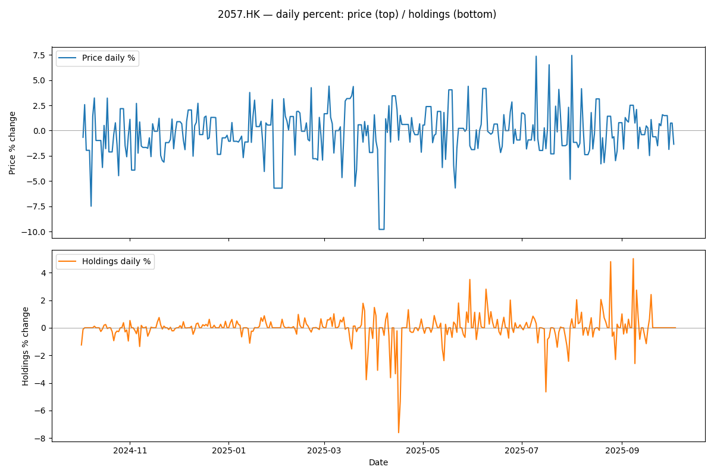
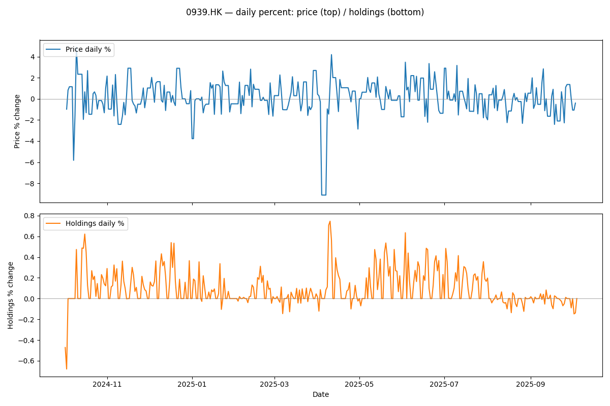
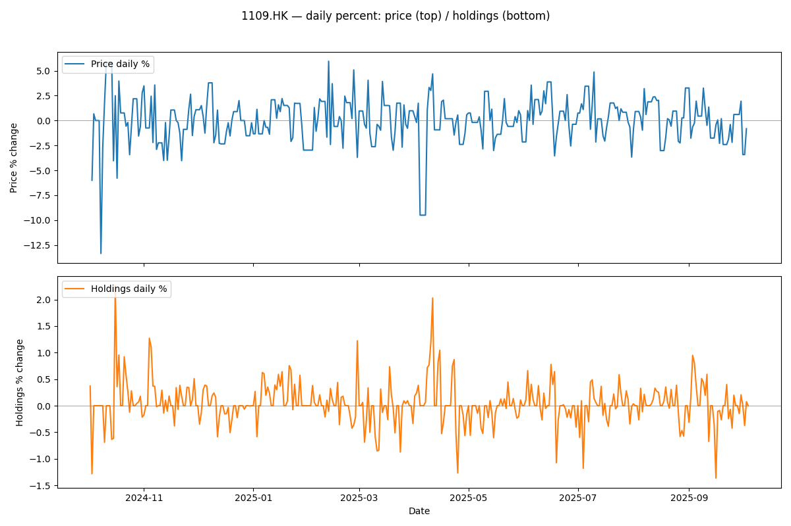
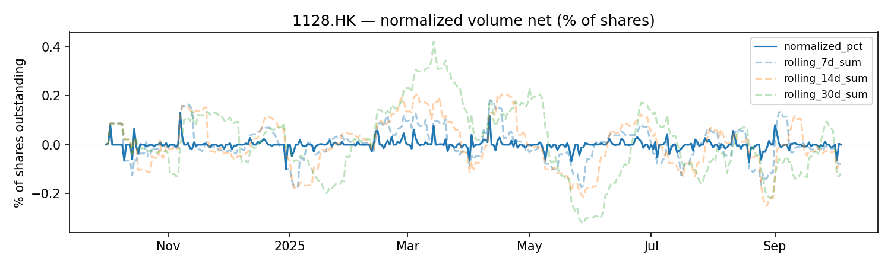
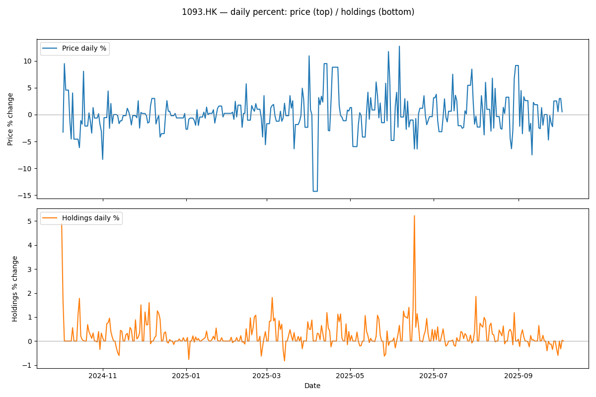

# HKEX Daily Net Position Change vs Return

Research Window: Oct 1, 2024 to Sep 30, 2025

Plots For Each Symbol: 
1. Daily return
2. Daily net position change
3. Normalized net position change with rolling horizons

Data Source: Yahoo Finance, HKEX

## 1997.HK

## 6690.HK

## 0669.HK

## 1928.HK

## 2319.HK

## 2057.HK

## 1113.HK

## 2688.HK

## 1929.HK

## 0883.HK

## 6862.HK

## 2020.HK

## 0016.HK

## 3690.HK

## 2899.HK

## 2269.HK

## 0316.HK

## 0200.HK

## 0001.HK

## 0981.HK

## 0241.HK

## 3692.HK

## 2313.HK

## 0968.HK

## 0868.HK

## 1024.HK

## 0939.HK

## 0003.HK

## 2015.HK

## 1299.HK

## 2282.HK

## 0941.HK

## 0027.HK

## 1810.HK

## 1099.HK

## 0880.HK

## 1398.HK

## 3988.HK

## 1109.HK

## 1038.HK

## 1378.HK

## 1088.HK

## 0960.HK

## 0388.HK

## 9633.HK

## 0322.HK

## 1128.HK

## 9618.HK

## 2382.HK

## 0267.HK

## 1044.HK

## 0291.HK

## 0002.HK

## 2628.HK

## 2359.HK

## 0005.HK

## 1093.HK

## 3968.HK

## 0012.HK

## 0762.HK

