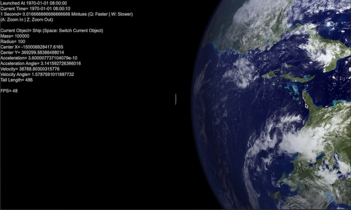
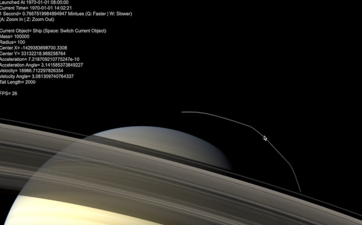
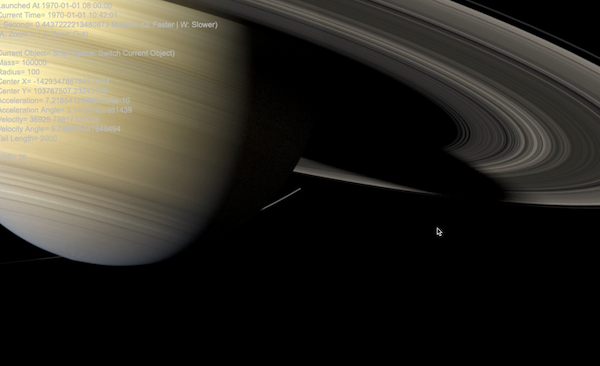
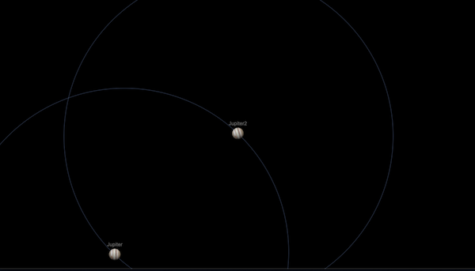

# EDDY'S SECRET GARAGE

## SOLAR SIMULATION FOR MY SON, MARS

This is your spaceship. Use arrow key Up/Down for speed up/down, left/right for steering. "A"/"Z" to zoom in/out, "Q"/"W" to accelerate/decelerate in time. 


This is your spaceship. Use arrow key Up/Down for speed up/down, left/right for steering. "A"/"Z" to zoom in/out, "Q"/"W" to accelerate/decelerate in time. 



This is your spaceship. Use arrow key Up/Down for speed up/down, left/right for steering. "A"/"Z" to zoom in/out, "Q"/"W" to accelerate/decelerate in time. 



This is your spaceship. Use arrow key Up/Down for speed up/down, left/right for steering. "A"/"Z" to zoom in/out, "Q"/"W" to accelerate/decelerate in time. 



This is your spaceship. Use arrow key Up/Down for speed up/down, left/right for steering. "A"/"Z" to zoom in/out, "Q"/"W" to accelerate/decelerate in time. 


This is your spaceship. Use arrow key Up/Down for speed up/down, left/right for steering. "A"/"Z" to zoom in/out, "Q"/"W" to accelerate/decelerate in time. 


This is your spaceship. Use arrow key Up/Down for speed up/down, left/right for steering. "A"/"Z" to zoom in/out, "Q"/"W" to accelerate/decelerate in time. 



To build this, I started off by researching on the physics behind the curtain, like the [Wikipedia on the Elliptic orbit](https://en.wikipedia.org/wiki/Elliptic_orbit) and ...

Then I setup an annimation loop to visualize all objects and their ever changin properties.

```markdown
r=Math.pow((X-x)*(X-x)+(Y-y)*(Y-y),1/2);
A=dv-getAngle(X-x, Y-y);
a=-G*M*m/(m*v*v-2*G*M*m/r);
d=G*G*M*M*m*m-4*(m*v*v*r*r*Math.sin(A)*Math.sin(A)/2)*(G*M*m/r-m*v*v/2);
c1=1/((G*M*m+Math.pow(d, 1/2))/(m*v*v*r*r*Math.sin(A)*Math.sin(A)))-a;
c2=1/((G*M*m-Math.pow(d, 1/2))/(m*v*v*r*r*Math.sin(A)*Math.sin(A)))-a;
b=Math.pow(a*a-c2*c2,1/2);
var tt=(r*r+4*c2*c2-(2*a-r)*(2*a-r))/(4*r*c2);
if (tt>1){tt=1} else if (tt<-1){tt=-1};
t= Math.acos(tt);
rot=t+getAngle(x,y);
```
