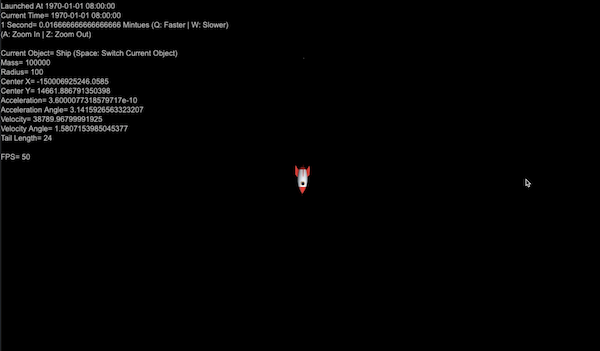

# EDDY'S SECRET GARAGE

## SOLAR SIMULATION FOR MY SON, MARS

Markdown is a lightweight and easy-to-use syntax for styling your writing. It includes conventions for


<<<<<<< HEAD
# Header 1
## Header 2
### Header 3

- Bulleted
- List

1. Numbered
2. List

**Bold** and _Italic_ and `Code` text

[Link](url) and 
```


=======

>>>>>>> e493aa552aa5be960404115fce2a5c526b640db6

[Wikipedia on the Elliptic orbit](https://en.wikipedia.org/wiki/Elliptic_orbit)

