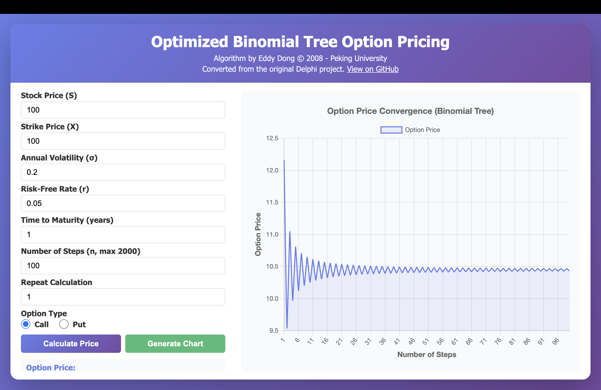
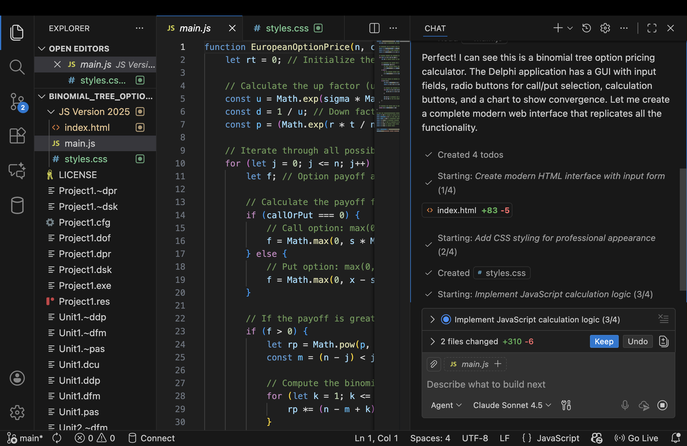

# EDDY'S CYBER GARAGE!

With love, for my son Mars Z. Dong.

Improved binomial-tree option pricing algothm designed by me in 2008 when I was in Peking University. May not be impressive today but was something back then by pushing the iteration step limit up to 2000 on the computers of that time.

Converted from the old Delphi project by AI.

[Try the Web version](https://eddydong.github.io/binomial_tree_option_pricing)

[GO BACK TO MAIN](index.md)