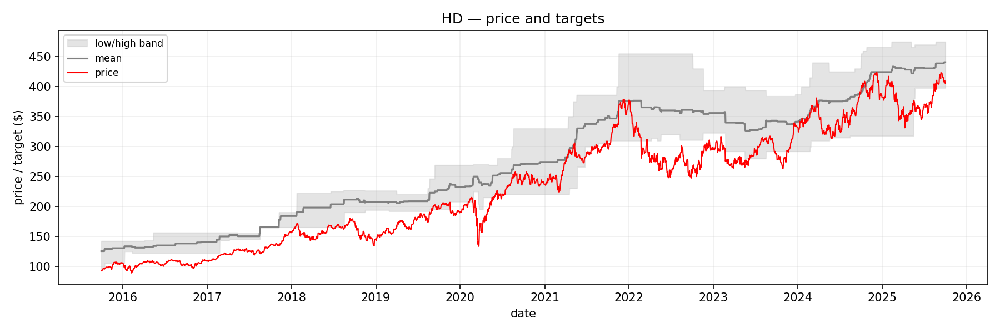
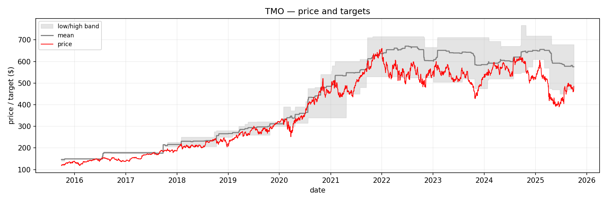

# SP100 consolidated plots

Generated plots: price (red), mean (grey), low/high band (light grey)

## ABBV

## ABT

## ACN

## ADBE

## ADI

## ADP

## AMAT

## AMD

## AMGN

## AXP

## BA

## BAC

## BLK

## BSX

## BX

## CAT

## CB

## CMCSA

## COF

## COP

## COST

## CRM

## CSCO

## CVX

## DE

## DHR

## DIS

## ETN

## GILD

## GS

## HD

## HON

## IBM

## INTC

## INTU

## JNJ

## JPM

## KKR

## KLAC

## KO

## LLY

## LMT

## LOW

## MA

## MCD

## MDT

## MRK

## MS

## MSFT

## MU

## NFLX

## NOW

## ORCL

## PEP

## PFE

## PG

## PGR

## PM

## QCOM

## SCHW

## T

## TJX

## TMO

## TMUS

## TXN

## UNH

## UNP

## V

## VZ

## WELL

## WFC

## XOM

