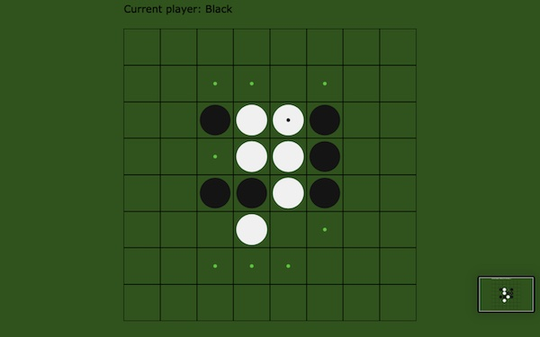

# EDDY'S CYBER GARAGE!

With love, for my son Mars Z. Dong.

[GO BACK TO MAIN](index.md)

### REVSERSI

[Play Reversi with Eddy's brainchild!](https://eddydong.github.io/reversi)
(Use Backspace to regret and withdraw your last move)



This is to commemorate my first AI algorithm back in 2001. The original one was done in Turbo Pascal and then in Delphi - congrats you're "experienced enough" if you've heard any of those names ;-) - and now I re-wrote it in Javascript.

The basic idea behind the AI algorithm was like the following:

1. List all eligible positions that you can place your piece at;
2. Note down the gain (number of opponent pieces you can reverse) you can get for each of these eligible positions;
3. Imagine you are now your opponent, and repeat #1 & #2 but for #2 you add a minus sign in front of the gain;
4. Repeat step #1 to #3 for several times (depth of AI thinking);
5. The position with the highest gain value should be your next step.

Sound easy but it needs some work to really turn the idea into workable code, for instances:

First you need to setup the chess map:

```markdown
function initmap(){
	map=[];
	for (var i=0; i<mapsize; i++){
		map.push([]);
		for (var j=0; j<mapsize; j++)
			map[i].push(0);
	};
	map[parseInt(mapsize/2)-1][parseInt(mapsize/2)-1]=1;
	map[parseInt(mapsize/2)-1][parseInt(mapsize/2)]=2;
	map[parseInt(mapsize/2)][parseInt(mapsize/2)-1]=2;
	map[parseInt(mapsize/2)][parseInt(mapsize/2)]=1;
};
```

For #1, you need define the game rules - how to define an eligible move:
```markdown
function cango(player, themap){
	for (var i=0; i<mapsize; i++)
		for (var j=0; j<mapsize; j++)
			if (caneat(player,themap, j,i)[0]>0) return true;
	return false;
};
```

For #2, you need to calculate your gain (or your loss if current player is your opponent) with a [recursive function](https://en.wikipedia.org/wiki/Recursion_(computer_science)) like the following:
```markdown
function bestmove(player, ai_level){
	var tempmap=[], direct_gain;
	var maxgain, maxx, maxy, over=true;
	for (var i=0; i<mapsize; i++)
		for (var j=0; j<mapsize; j++) {
			direct_gain=caneat(player, draftmap, j,i);
			if (direct_gain[0]>0){			
				if (ai_level>1){
					tempmap=copymap(draftmap);
					eat(player, draftmap, j, i);
					var res, gain;
					res = bestmove(3-player, ai_level-1);
					if (res[2]==-99991021) {
						bestmove(player, ai_level-1);
						gain = direct_gain[1] + res[2];
					} else gain = direct_gain[1] - res[2];
					draftmap=copymap(tempmap);
				} else gain=direct_gain[1];
				if (maxgain==null || gain > maxgain || 
					(gain==maxgain && Math.random()>0.5)){
					maxgain=gain;
					maxx=j;
					maxy=i;
				};
				over=false;
			};
		};
	if (over){
		if (player==curPlayer) maxgain=-99999
			else maxgain=-99991021;
	};
	return [maxx,maxy,maxgain];
};
```

Please refer to the [My Github Project](https://github.com/eddydong/reversi) for the rest of the program, together with other versions, for instance the "AI Combat Mode", in which you put different AI algorithms, or the same algorithm but with different sets of AI parameters, and let them fight with each other and find out who is number one. You may setup 100 rounds and record the win's and loss'es for each algorithm - just like the A/B test. [AI Combat Version](https://eddydong.github.io/reversi/reversi AI arena 1.html)

Here is a screenshot for the ongoing combat between 2 of my algorithms:


Theoretically, if the computer is fast enough to do a 30 level deep thinking using this algorithm, there will be no chance for its challenger to win at all. But the reality is: this algorithm runs slow even on a modern computer when the depth of search is set above 6. In other words, although it has already been very hard to defeat, but it's obviously not 100% sure that it will win the game.

One way to improve this is to add some human experience rules on top of the search algorithm. To be specific, at the last (bottom) layer of the imaginary evaluation, instead of returning the gain/loss of that layer, arbitrage human touches on important positions on the map - like the 4 corners and some positions near them, and the 4 edges etc - will be added on top of the results of the search algorithm.

Looks like a easy game and there are only a few scores of positions to consider and thus the game is always very quick. You may start thinking of solving it completely with any better algorithm. But the reality is:

>The Othello 8x8 game tree size is estimated at 10<sup>54</sup> nodes, and the number of legal positions is estimated at less than 10<sup>28</sup>. The game remains unsolved. A solution could possibly be found using intensive computation with top programs on fast parallel hardware or through distributed computation.
[Computer Othello on Wikipedia](https://en.wikipedia.org/wiki/Computer_Othello)

Let's go visit and worship the strongest Reversi (or Othello) algorithm on this planet so far:
[LOGISTELLO](https://skatgame.net/mburo/log.html)

All Right Reserved (C) Eddy K. Dong 2022

[GO BACK TO MAIN](index.md)