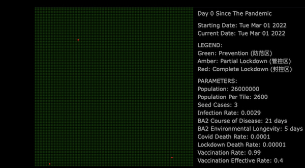
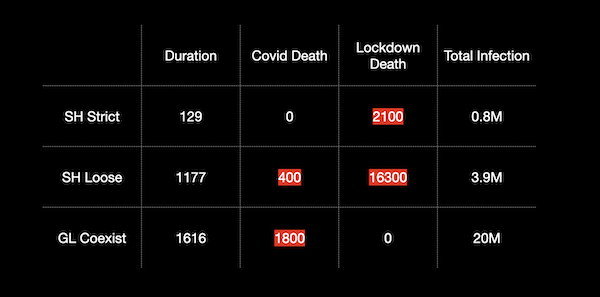

# EDDY'S CYBER GARAGE!

With love, for my son Mars Z. Dong.

[GO BACK TO MAIN](index.md)


### SHANGHAI PANDEMIC SIMULATION

Hey guys this is Eddy. I’m been working from home in Shanghai for 6 weeks in a row and now trapped in the lockdown. Like everyone in this city, I want to know more about what’s going on, and what it could be moving forward. So I devoted my weekend to write [this simulator](https://eddydong.github.io/shanghai).


<video width="80%" controls>
  <source src="img/shanghai/simulation.mp4" type="video/mp4">
  Your browser does not support the video tag.
</video>


First, my goals here are simple: trying to estimate the duration of this pandemic, the death toll of the BA2 infection and of other causes related to the lockdown, and the accumulated cases when it’s all over. And I set up 3 imaginary scenarios to analysis the impact of different interference methodologies.

Then I thought of quite a few hypotheses for the simulation, and when you translate them into mathematical language, you get the pandemic models. And when you assemble the models with computer programming, you will get the simulator, and then you can play with it and test your ideas. 

- You got a large city with 26M people living in 20K communities.
- People live in a certain place but they travels around on daily basis, following certain pattern like skewing to their residence etc.
- One has a chance to get contracted when visiting a community in which positive cases were reported within a certain number of days.
- A positive case will be quarantined, but sometimes with a lag of days.
- Vaccination can lower the transmission & the death rate.
- Virus can survive outside its host, human for instance, for certain days.
- Lockdown will be throttled in 3-phase, decided by recency of the latest positive case. Different phases have different level of mobility limitation.
- People have certain chance to die from COVID infection.
- People who have contracted the virus got immunity for years.
- People have certain chance to die from severe disease other than COVID due to limitation of transportation/logistics, especially in the top phase lockdown.
- Imported cases from outside Shanghai not considered in the simulation.

From open sources I collected some data to describe the behavior of the virus, like how long it can survive in and outside its host, infection rate and death rate etc, and the behavior of people, like how frequently they will travel around in the city under different scenarios and where are they going etc, and some nature of the city, like the population and the amount of communities etc, and the lockdown measures, like how much proportion of the cases will be quarantined and how swiftly this process is, how strict the restrictions are for transportation & logistics for each of the 3-phase lockdown levels under each of the 3 scenarios. One thing to point out is the death rates. From what we’ve observed in the first 40 days of the Shanghai pandemic, actual death rate could be somewhere near 1 death out of 200 thousand. But for safety redundancy here I deliberately put an exaggerated number: 1 death out of 10 thousand. So we can be more confident to say that that the reality will be no worse than the simulation. For the non-covid lockdown death rate, we assume there will be 1 person die from lockdown related restrictions out of 1 million people in home confinement only. For we’ve seen so far, this should be a conservative estimation. We don’t want to underestimate the COVID death and overestimate the lockdown death.

```markdown
const
	virusLongevityInHost=21, // BA2 survival days inside host
	virusLongevityInEnv=7,	// BA2 survival days outside host
	mobilitySkewness=0.7, // proportion of traveling within adjacent communities
	population= 260000, // population index of Shanghai
	scale=100, // times which we get the real population number
	seedCases= 3, // positive case proportion in total population at the begining
	infectionRate= 0.00252, // chance for a positive case to spread the virus to surrounding negative individuals in a day
	vaccinationRate = 0.776, // vaccination rate : vaccine can ONLY reduce death rate and won't affect spreading rate
	vaccinationEffectiveRate = 0.8; // chance for vaccinated people to resist BA2

	otherDeathRatio= 0.000001, // severe disease hit rate per person per day
	deathRateBA2=0.0016; // 1 death out of 10,000 positive cases
```

```markdown
var
  // [Quarantine Rate, Mobility Throttle[防范区, 管控区, 封控区], 
  //	Quarantine Lag, Scenario Name]
  scenarios=[
  // Scenario #0: No Interference
    [0.00, [1.00,1.00,1.00], 0, "No Intervention"],  	
  // Scenario #1: Shanghai Strict Mode
    [0.99, [0.10,0.05,0.01], 3, "Shanghai Strict Mode"],
  // Scenario #2: Shanghai Loose Mode
    [0.90, [0.40,0.05,0.01], 3, "Shanghai Loose Mode"],  
  // Scenario #3: Global Coexist Mode
    [0.30, [1.00,1.00,1.00], 7, "Global Coexist Mode"]   
  ],
  // intervention approach applied since interventionStartDay
  interference=3, 
```

And here is how I want the simulation to be visualized. As you can see we have many green boxes here. Each represents a residence community. There are 2600 people live in each of these communities. If we put a matrix of 100 by 100 communities, we get a city with 26 million population. 
Let’s zoom out. You may notice the 3 red boxes out there. These are the communities in which our seed positive cases were first detected. In fact the boxes were color coded according to the Shanghai 3-phase lockdown system where Red stands for Complete Lockdown, Amber for Partial Lockdown and Green for Prevention. 
Then on the right we will have all the constants, parameters and variables for the simulation. 
On the bottom left, we have 5 charts to show key indicators like the daily new cases, death toll etc.



Then I stitched all the hypotheses, scenarios, models and data together with computer programming, and realized the visualization concept I’ve just shown you. Some critical codes are like the following:

- Virus spreading in communities:
```markdown
if (p.status==0 && !p.immune){
	var x=p.x, y=p.y;
	if (Math.random() < infectionRate)
		if (moved==0 && tiles[y][x].lastPositive+virusLongevityInEnv>=day ||
			(moved==2 && tiles[yy][xx].lastPositive+virusLongevityInEnv>=day) || (moved==1 &&
		(  (x<tileW-1) && (tiles[y][x+1].lastPositive+virusLongevityInEnv>=day)
		|| (x>0) && (tiles[y][x-1].lastPositive+virusLongevityInEnv>=day)
		|| (y<tileH-1) && (tiles[y+1][x].lastPositive+virusLongevityInEnv>=day)
		|| (y<tileH-1) && (x<tileW-1) && (tiles[y+1][x+1].lastPositive+virusLongevityInEnv>=day)
		|| (y<tileH-1) && (x>0) && (tiles[y+1][x-1].lastPositive+virusLongevityInEnv>=day)
		|| (y>0) && (tiles[y-1][x].lastPositive+virusLongevityInEnv>=day)
		|| (y>0) && (x<tileW-1) && (tiles[y-1][x+1].lastPositive+virusLongevityInEnv>=day)
		|| (y>0) && (x>0) && (tiles[y-1][x-1].lastPositive+virusLongevityInEnv>=day) ))) {
			p.status=1;
			p.testedPositive=day;
			tiles[p.y][p.x].status=2; 
			tiles[p.y][p.x].lastPositive=day;
		};
};
```

- Quarantining:
```markdown
if (p.status==1 && !p.quarantined && (day-p.testedPositive)>=scenarios[scenario][2])
	if (Math.random()<scenarios[scenario][0]) 
		p.quarantined=1;
```

- Individual recovering, getting immuned or dead from Covid:
```markdown
if (p.status==1 && day-p.testedPositive>durationPositive){
	p.status=0;
	if (p.quarantined) p.quarantined=0;
	p.immune=1;
	var vaccineWorks= 0;
	if (p.vaccinated && Math.random()<vaccinationEffectiveRate)
		vaccineWorks=1;			
	if (Math.random()<deathRateBA2 && !vaccineWorks) p.dead=1;
};
```

- Individual dead from other causes related to the lockdown:
```markdown
if (Math.random()<otherDeathRatio && 
	Math.random()>scenarios[scenario][1][tiles[p.y][p.x].status]){
	p.dead=2;
};
```

Now it’s time to play with your creation. First is the Shanghai Strict Mode, in which you will have the highest quarantine rate for positive cases, and most people will be required to stay at home. For each of the 3 phase respectively: 15 percent mobility freedom for communities under Prevention, 5 percent for those under Partial Lockdown, and 1 percent for Complete lockdown. 


Then the Loose Mode, in which you will have lower but still high quarantine rate for positive cases, and people still be required to stay home but the restrictions are less strictly followed. Again, for each of the 3 phase: 40 percent mobility freedom for communities under Prevention, 20 percent for those under Partial Lockdown, and 5 percent for Complete lockdown. 


Then the third scenario, the so called coexist mode which has been widely adopted by most countries in the world, in which you will have limited quarantine rate for positive cases, and besides the positive cases there is no mobility restrictions. You may ask, if the pandemic will end at all? Yes because people get immuned for a while after contract the virus, and when infection rate climbs to a certain degree, the virus will run out of food and die out - this is also called Herd Immunity.


Now we’ve done all simulations for the 3 scenarios. Let’s conclude a little bit. Here you can see the total death toll for the 3 scenarios, or the 3 different interference methods. The Loose Mode has the highest total death toll of nearly 4 thousand. Strict Mode caused more than 2 thousand deaths. For both of these 2 lockdown scenarios, there is no death reported from contracting the virus - all deaths were caused by the restrictions on mobility. Total infections are 0.4M and 1.4M respectively. In Strict mode, the pandemic ended in 4 months, and in the Loose mode, it lasted more than 10 months. In the coexist mode, total infection reached 15m when a 4 year long pandemic is over. Total death toll from the BA2 infection was less than 1 thousand. And obvious there was no death from lockdown measures because there was no lockdown at all.



Finally, I wish the pandemic will end and we will go back to our normal life soon. Stay safe until then!

Thank you.

#### DISCLAIMER

ANY THEORIES, DATA & MODELS HEREIN ARE IMAGINARY AND NOT REFLECTING THE REAL WORLD. ANY PREDICTIVE RESULTS HEREIN ARE JUST FOR THE PURPOSE OF ACADEMIC RESEARCH. NO PERSON OR ENTITY SHOULD MAKE DECISIONS ON THESE PREDICTIONS. BY NO MEANS THE AUTHOR WILL BE HELD ACCOUNTABLE FOR ANY DAMAGE IT MAY CAUSE. 

All Right Reserved (C) Eddy K. Dong 2022

[GO BACK TO MAIN](index.md)