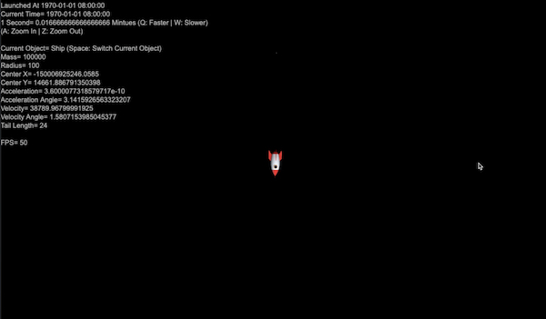
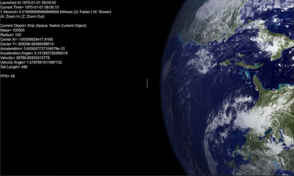
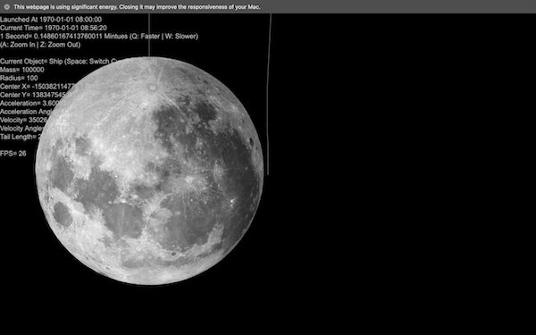
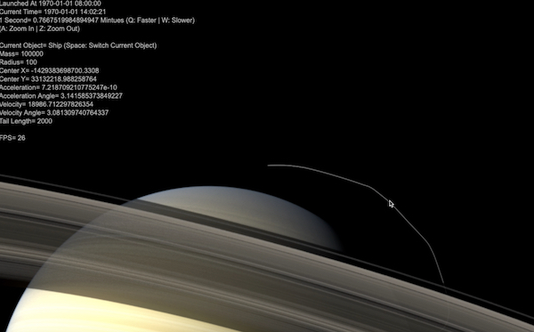
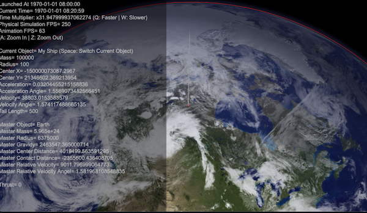
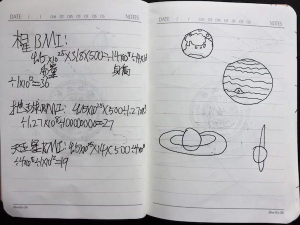

# EDDY'S CYBER GARAGE!

With love, for my son Mars Z. Dong.

[GO BACK TO MAIN](index.md)

<video width="80%" controls>
  <source src="img/solar/intro.mp4" type="video/mp4">
  Your browser does not support the video tag.
</video>

### SOLAR SYSTEM SANDBOX

Floating in the solitude of the deep darkness of the universe, you are in your super spaceship and about to explore our Solar system. The universe you're in is 2-dimentional - simplifying things but still reflecting much of the essentials - and in it there are only the Sun and its 9 planets (Pluto included for the moment, and plus the Moon) and you & your spaceshipt pulling one another by the Newton's law - Gravity is considered in beteen any 2 of the 12 astronomical objects including you.

First, let's warm up by trying the controls. Use arrow key Up/Down for speed up/down, left/right for steering. "A"/"Z" to zoom in/out, "Q"/"W" to accelerate/decelerate in time (Known bug: high time mulitiplier may cause significant inaccuracy in the simulation). 

[Transport me to that Spaceship!](https://eddydong.github.io/solar)



Now you can try to orbit your home - the Earth. At the given speed of 7.9km/s, speed relevant to the Earth to be precise, it should be circling the Earth perfectly. "Relevant" here refers to the fact that the Earth itself is orbiting the Sun at roughly 30km/s - yes that's fast! You may also ask, is the Sun also moving? For sure! It travels around the center of the Milkyway Galaxy. That's it - in physics, nothing is absolutely "static". It's all about relativity!



OK now it's time to follow the steps of the Apollo 11 - fly me to the Moon! Now you'll find out how FAR the moon actually is... And how difficult it is to orbit your spacecraft around a fast moving astronomical object. When you travel from the Earth to the Moon, the dominant gravity field will change from the Earth's to the Moon's - to be precise there is also the Sun's somewhere in the middle - and you need to change your reference system to the Moon as well to obtain relative speed/acceleration and angle etc.



Since you've successfully traveled and orbited the Moon, you might start thinking of something even bigger. What about other planet? Maybe the most unique looking one... the one with the big ring? Why not! Challenge is that it's such a LOOOOOONG distance between the Saturn and the Earth, you may need to accelerate to the speed of light - no worries here! Your super space literally has no limit on speed! Just push "UP" and and it will soon bring you up to the God speed! (Be aware to decelerate speed/time when it comes closer or you will miss your shot!)



All astronomical objects are presented with high-resolution textures for this simulation. The Saturn, for instance, has a beautiful signature ring that you can fly through! Enjoy dancing with the big ring planet!


If flying through the ring of Saturn is still not crazy enough for you, let's switch of the collision detection for a while and do somethign really crazy! First, let's feel the gravity pull. You'll be lanuching the spaceship from the surface of the Earth and if you do not steer it to the orbital direction, it will do a free fall to the center of the Earth and be accelerated to an unbelievable high speed. This is called the Gravity Assist - an extreme one in this case - it's so strong and it fires you like a bullet to the deep space for a journey of no return...



The nex crazy thing you might find interesting to do is to orbit the Sun. You will find out how fast you must be to balance the mighty pull of the Sun. Teperature is not considered in this simulation so don't be afraid of being melt down if getting too close to the surface. With a larger speed, you will enter an elliptic orbit around the Sun and, yes, you will be like a comet! Zoom out in view & time to see your trail and feel the formidable vast of space!


Finally, let's do some physical experiments, like the 2-star system. If you put another Jupiter near the current Jupiter and give it an initial speed, you'll likely get them circling around each other, and at the same time both of them circling the Sun. Turning on the trail display and you'll find how amazing their moving is. One step further, if you add the 3rd Jupiter into this 2-star system, you'll witness the ["Double Pendulum"](https://en.wikipedia.org/wiki/Double_pendulum#Chaotic_motion) or the Chaotic Motion or the Butterfly Effect - Chances are, they will smash into each other, if collision detection is on, or one or more Jupiters will shoot out of the system by the Gravity Assist.


To build this, I started off by researching on the physics behind the curtain, like the [Wikipedia on the Elliptic orbit](https://en.wikipedia.org/wiki/Elliptic_orbit) and many more. Finally I concluded the following key formulars for the computation of real-time orbit, speed/acceleration and the angle for each and every astronomical bodies including the little spaceship.

```markdown
//name, img, imgScale, imgOffsetX, imgOffsetY, x, y, r, m, v, dv
r=Math.pow((X-x)*(X-x)+(Y-y)*(Y-y),1/2);
A=dv-getAngle(X-x, Y-y);
a=-G*M*m/(m*v*v-2*G*M*m/r);
d=G*G*M*M*m*m-4*(m*v*v*r*r*Math.sin(A)*Math.sin(A)/2)*(G*M*m/r-m*v*v/2);
c1=1/((G*M*m+Math.pow(d, 1/2))/(m*v*v*r*r*Math.sin(A)*Math.sin(A)))-a;
c2=1/((G*M*m-Math.pow(d, 1/2))/(m*v*v*r*r*Math.sin(A)*Math.sin(A)))-a;
b=Math.pow(a*a-c2*c2,1/2);
var tt=(r*r+4*c2*c2-(2*a-r)*(2*a-r))/(4*r*c2);
if (tt>1){tt=1} else if (tt<-1){tt=-1};
t= Math.acos(tt);
rot=t+getAngle(x,y);
```

Here is one of the original sketches I made to figure the physics out, which led to above shown codes:


All phsical data were obtained from the internet and should be roughly reflect the reality of our Solar System.

```markdown
//name, img, imgScale, imgOffsetX, imgOffsetY, x, y, r, m, v, dv
earth= new Ball('Earth', ImgEarth, 1.02, 0,0, -1.5e11, 0, 6.375e6, 5.965e24, 29.79e3, Math.PI/2);
moon=new Ball('Moon', ImgMoon, 1, 0,0,  -384000e3-1.5e11,0, 1738.14e3, 7.349e22, 1020+29.79e3, Math.PI/2);
sun = new Ball('Sun', ImgSun, 1.17,  0,0, 0,0, 696300e3, 1.989e30, 0, 0);
mercury = new Ball('Mercury', ImgMercury, 1, 0,0,  -5791e7,0, 2440e3, 5.965e24*0.0553, 47.89e3, Math.PI/2);
venus = new Ball('Venus', ImgVenus, 1, 0,0,  -108208930e3,0, 6052e3, 5.965e24*0.815, 35.03e3, -Math.PI/2);
mars = new Ball('Mars', ImgMars, 1, 0,0,  -227940000e3,0, 3398e3, 5.965e24*0.1074, 24.13e3, Math.PI/2);
jupiter = new Ball('Jupiter', ImgJupiter, 1, 0,0,  -778330000e3,0, 71492e3, 1.9e27, 13.06e3, Math.PI/2);
saturn = new Ball('Saturn', ImgSaturn, 3, -0.012,0.016,  -1429400000e3,0, 60330e3, 5.965e24*95.18, 9.65e3, Math.PI/2);
uranus = new Ball('Uranus', ImgUranus, 1, 0,0,  -19.2184*AU,0, 25559e3, 5.965e24*14.54, 6.81e3, Math.PI/2);
neptune = new Ball('Neptune', ImgNeptune, 1, 0,0,  -30.1104*AU,0, 24764e3, 5.965e24*17.15, 5.43e3, Math.PI/2);

me = new Ball('Ship', ImgShip, 1, 0,0, -(6.375e6+1e2+550e3)-1.5e11, 0, 1e2, 100e3, 9000+29.79e3, Math.PI/2+0.01);
```

Then I setup an annimation loop with [RequestAnimationFrame](https://developer.mozilla.org/en-US/docs/Web/API/window/requestAnimationFrame) and used the [Canvas](https://developer.mozilla.org/en-US/docs/Web/API/Canvas_API) to visualize all objects and their ever changing properties.

This project was designed & implemented for my son, Mars, who is a big fun of Astronomy back in 2020 or so - 2 years ago from today. Not all funcitonalities mentioned above were were consolidated into the same program, the html file, yet, meaning you may need to try other ones in the same folder - let me know if you have particular interest in any of them and I'll help you find it out.

Finally, here is why I started this project in the first place: I accidentally came across these in my son's "secret journal" and discovered his universe fantasy ;-)





I was indeed inspired by his fantasy to make this project. Hope it also inspires you in some way.

Eddy K. Dong
June 11, 2022

[GO BACK TO MAIN](index.md)